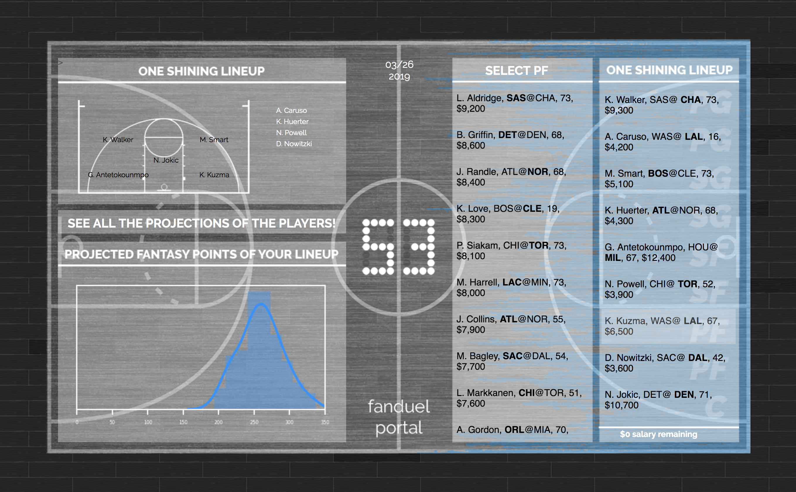

# SportsExclamation

## Introduction

•	An App that provides Daily Fantasy Basketball players with a tool to customize ideal lineups for their entries  
•	Offers features like dashboard and visualization to allow users to explore basketball data with ease and freedom, different from tabular data information offered by existing companies on the market  
•	Techniques used include Flask, EC2 (Amazon Web Service), Python, HTML, CSS, JavaScript and Photoshop   
•	Project for Product Analytics Course at USF MSDS program

## Product Poster

## Demo

Homepage  
  

Lineup Portal   
  
  
Player Stats Page  
  
  
Player Projections Comparison Page  
  
  
## Authors

Jon-Ross Presta
Max Alfaro 
Evan Liu
Xu Lian
